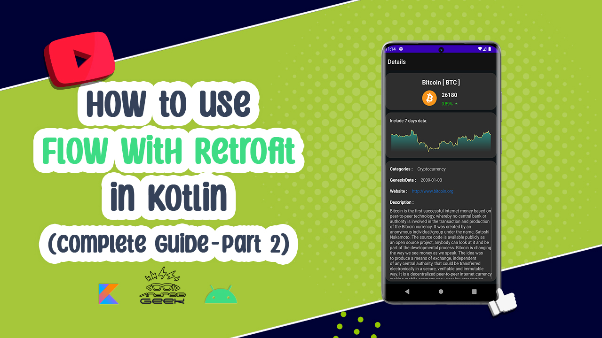
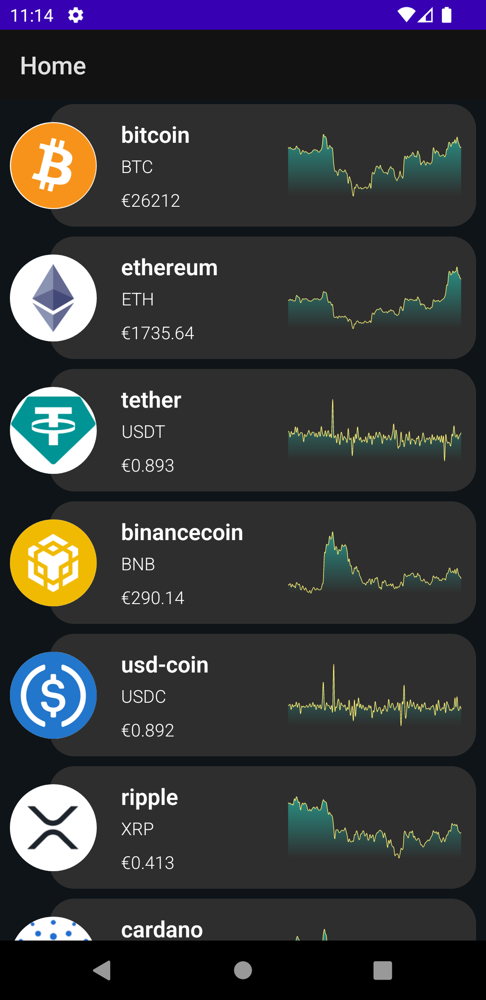
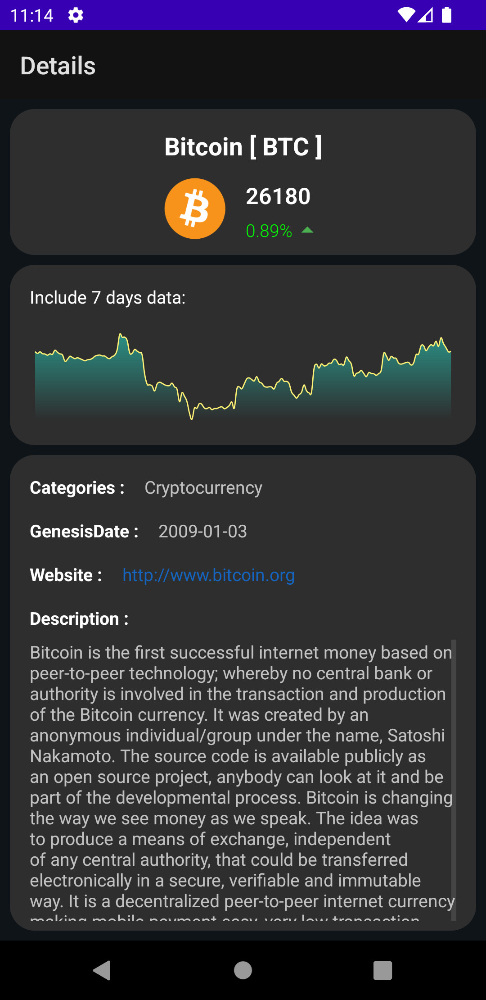

# Flow-Retrofit-Youtube

</a>

 
YouTube Video 
  
Part 1:
  

  
  
Part 2 :
  

  

  
  
  
Preview :
  

  

Screen-Shot :
 

Article on Medium:
 
Part 1 : https://medium.com/@ezatpanah/how-to-use-flow-with-retrofit-complete-guide-part-1-34373ee53d73
  
Part 2 : https://medium.com/@ezatpanah/how-to-use-flow-with-retrofit-complete-guide-part-2-356a4932ae44

 
 
 
✨ Join Medium to read thousands of valuable stories ✨
 
https://medium.com/@ezatpanah/membership

